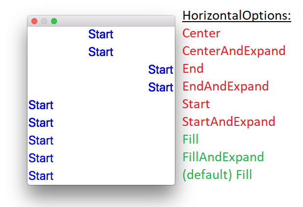

# Showcasing blurred text with Xamarin.Forms on MacOS

The project contains minimal code to show that (in some conditions), Labels are renders blurry **on non-retina displays**.

Zooming in makes the problem more visible:

| Blurred                                 | Sharp                              |
| --------------------------------------- | ---------------------------------- |
|  |  |

As you can see in [blurredText/blurredTextPage.xaml](blurredText/blurredTextPage.xaml), there are some Labels defined. Based on the HorizontalOptions set, the label appears blurry or sharp (the first 6 labels are blurred and the last 3 are sharp):

